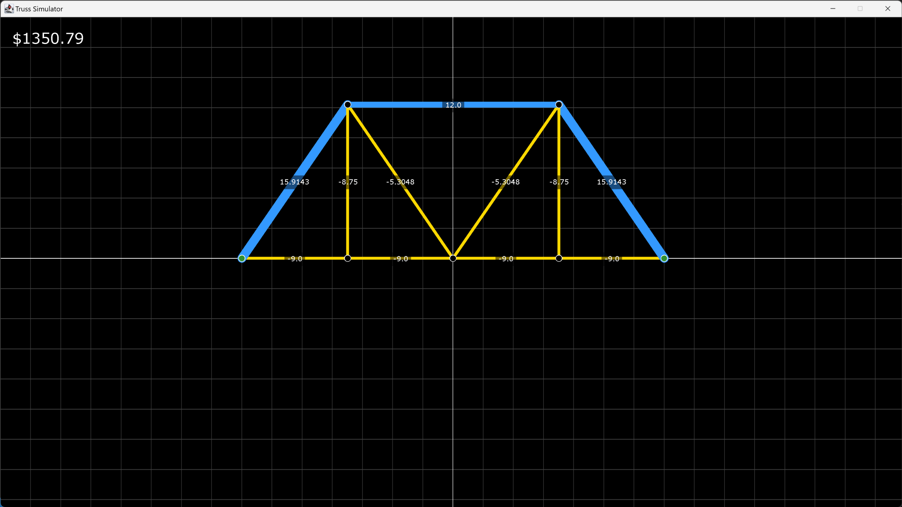
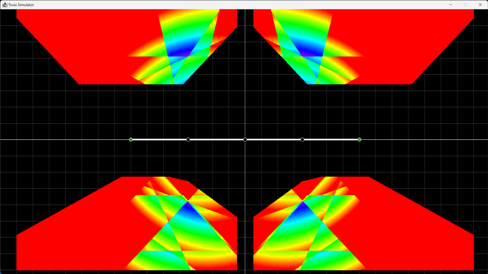

# Truss-Simulator

A truss simulator program in Java to solve and optimize a truss bridge.

## Features
- Solves truss bridges with given constraints and parameters using the method of joints
- Genetic algorithm implemented to optimize arbitrary bridge designs

### Additional features for two-variable trusses
In cases where there are enough constraints such that there are only two variables to optimize, the simulator has two additional features:
- Generate heat map of the 2D solution space
- Exhaustively search regions of the 2D solution space up to 10 decimal places

